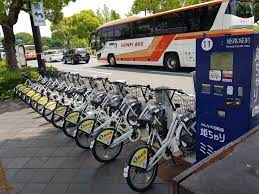
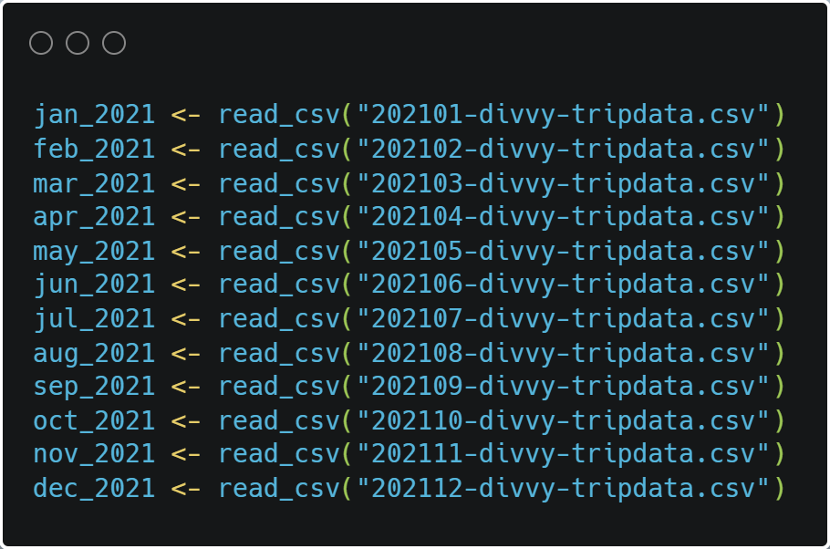
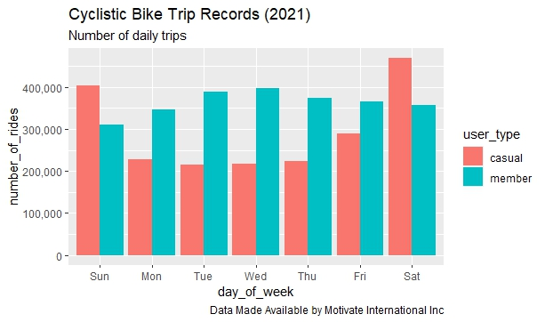

# Cyclistic-Bike share Analysis

--

## Introduction
This document demonstrates the analysis of a fictional bike-share company called **Cyclistic**. Cyclistic company user base are of two categories, the first category is based on subscription and are referred to as **_members_** , the second user category are the **_casuals_**. The goal was to figure out how user types differ from each other.It covers the entire procedure from data importation, wrangling, cleaning and finally analysis.

The dataset was made available by **Motivate International Inc**. I accessed the data first using a spreadsheet, this is what I do with every new dataset I work with because it gives me the opportunity to get an overview of the raw data,thereby giving me the idea of the steps that need to be taken as regards cleaning, this also helps me decide on the most suitable tool/tools to carry out my analysis.. This is a very detailed process, hnce a bit lenghty. Stick with me...

I concluded that R programming was best to conduct this analysis, and then went ahead to import the data...

## Business Question
- **_How does cyclistic user categories differ from each other_** ?

## Column Renaming
Column renaming is important to me because I prefer column names that I can relate to ,I went ahead to rename the ‘rideable_type’ and ‘member_casual’ columns in the individual dataframes to ‘bike_type’ and ‘user_type’ respectively, the new names are more suitable for the observations in the specific columns.

## Changing data types 
As part of making the columns consistent, I also converted the ‘bike_type’ and ‘ride_id’ columns, so as to have them in the right format.

 
 
 ## Combining individual data frames into one
 
 
 
 ## Removing unwanted column
 Once I had the monthly data combined into one dataframe, reviewing my business task in relation to the data available, I concluded that some columns are irrelevant to my analysis hence I decided to remove them and make my dataframe as concise as possible. I went ahead and removed the ‘start_lat’,‘start_long’,“end_lat”,‘end_lat’ columns.
 
 

 
 ## Adding new columns
 Based on my preliminary assessment of the data in relation to my business task, I concluded that a couple of new columns need to be created to serve as new data points of comparison between the two user categories. I went ahead to add columns “ride_length” and “day_of_the_week” .These new columns will give an idea of the average duration of rides and on what days of the week the trips happened.

 
 ## Removing blanks, nulls, n/a and creating a new dataframe to begin analysis
 **The final step in my cleaning process was to remove rows with blanks, and unwanted values.
 
 
 
 ## Visualization
 **_Firstly I decided to find out the toatl number of individual users by category in order to be sure of the numbers I am working with_**
 
 
 
 
 
 
 **_Next is the total number of daily rides per category_**
 
 
 
 **_Lastly is the total duration of daily rides per category_**
 
  
 
 ## Insights
-The number of users for the year about 4.5 million with member users making up 55% of that number, while the casual users make up 45%

-Through the course of the year, the weekends are the active days for cyclistic casual users with Saturday being the most active day with well over 400,000 (four hundred thousand) trips

-The weekdays are the active periods for the member users with Wednesday being the most active day with a little under 400,000 (four hundred thousand) trips

-Casual users spent over double the duration of time on trips with an average of over 2000 secs (about 38 minutes) spent on rides on Sundays through the year

-Member users spent an average of about 700 seconds(12 minutes) on rides through the course of the year

-In conclusion, despite the fact that there were more member users, casual users used Cyclistic more and also spent more time on trips than member users

 ## Recommendations
-Carry out a survey of casual users to ascertain the reasons why they are not members despite using Cyclistic more

-Give out price discounts on new membership registrations to encourage casual users to subscribe

-Create an Ad campaign targeting casual users via email letting them become aware on the discounts for new subscribers

 
 ## Data Limitations
-There was no specific data on what exact purpose both users make use of Ceyclistic, this would have enabled me further determine more difference and possibly the reason why casuals ride more on weekends and members on weekdays

-No available data on the price of trips

-It would have helped if we knew if the different users had a car or not, and if Cyclistic was their primary mode of transportation.

 
 
 

